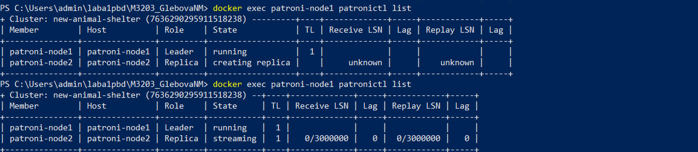
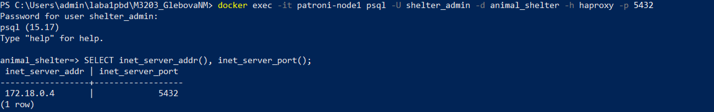
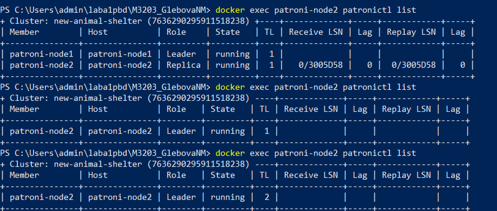
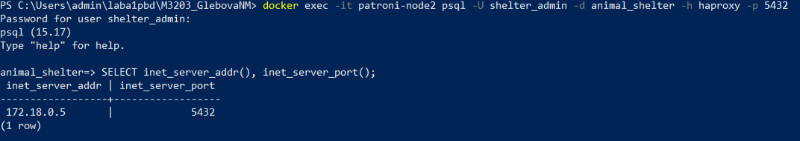
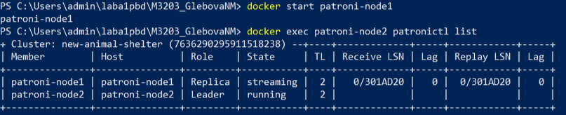

# Отказоустойчивость кластера СУБД

## Архитектура

- **`Patroni`** - управление кластером PostgreSQL (2 реплики: `primary` и `replica`)
- **`etcd`** - распределённоe хранилище конфигурации и координации выборов лидера
- **`HAProxy`** - единая точка входа клиентов в мастер

## Проверка отказоустойчивости

### Исходное состояние кластера

2 реплики: лидер - `patroni-node1`, реплика - `patroni-node2`. Сначала создается реплика, затем фиксируется работа репликации (в столбце `State`: `streaming`).

### Проверка подключения

Подключение идёт на конкретный узел (это текущий лидер, `patroni-node1`).

### Эмуляция отказа `primary`

Остановка контейнера с `primary`.

### Отслеживание состояния кластера

`patroni-node1` пропадает из списка, `patroni-node2` становится новым лидером.

### Повторная проверка подключения

Теперь подключение идёт на другой узел (текущий лидер, `patroni-node2`).

### Восстановление старого primary

Запуск контейнера `patroni-node1`. Этот узел становится репликой.

## Итог

При отказе (или остановке) текущего мастера происходит автоматическое переключение роли, клиент через `HAProxy` продолжает работать с новым `primary`.